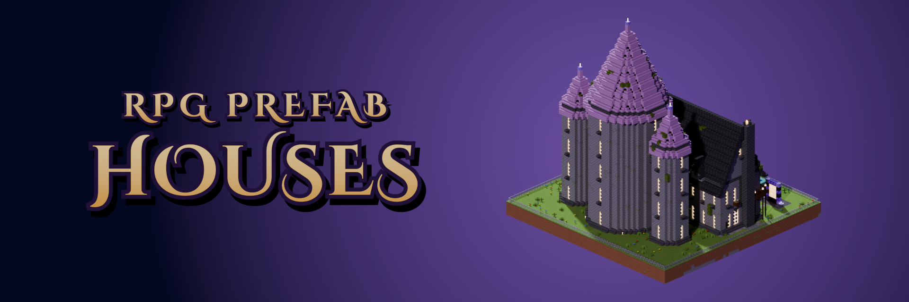
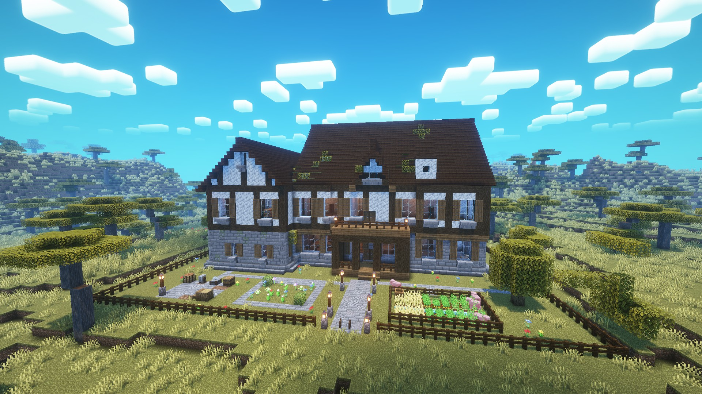
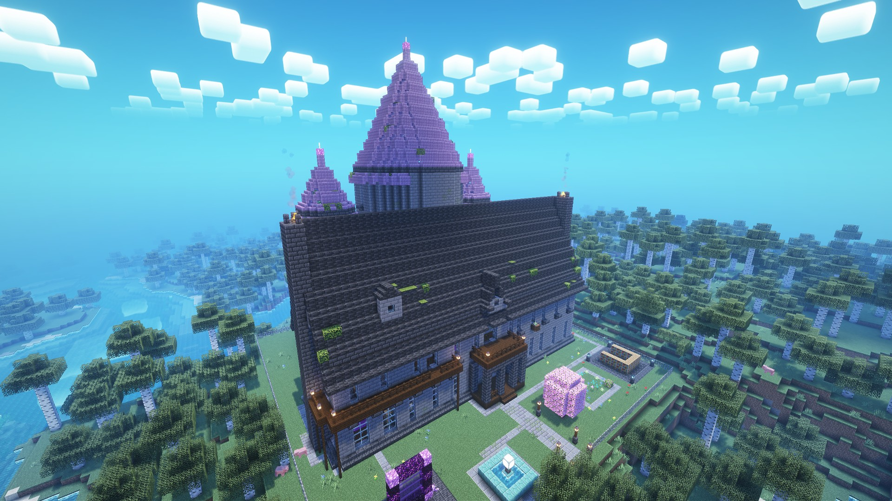
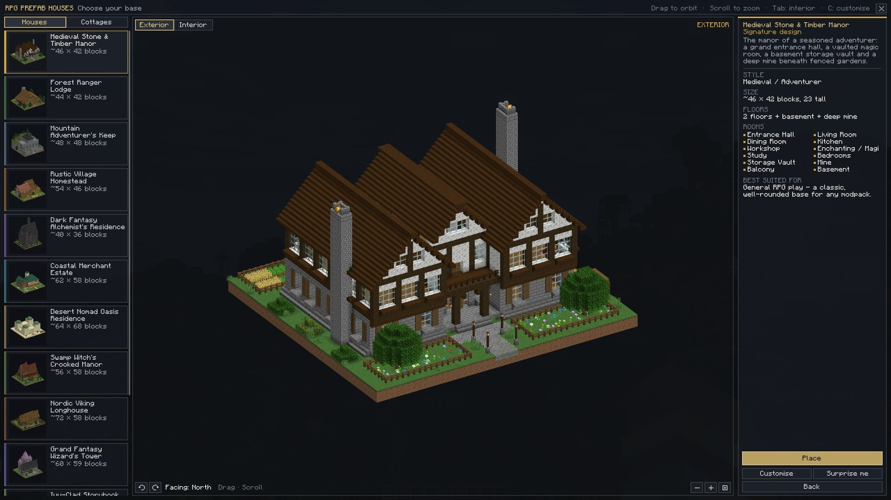
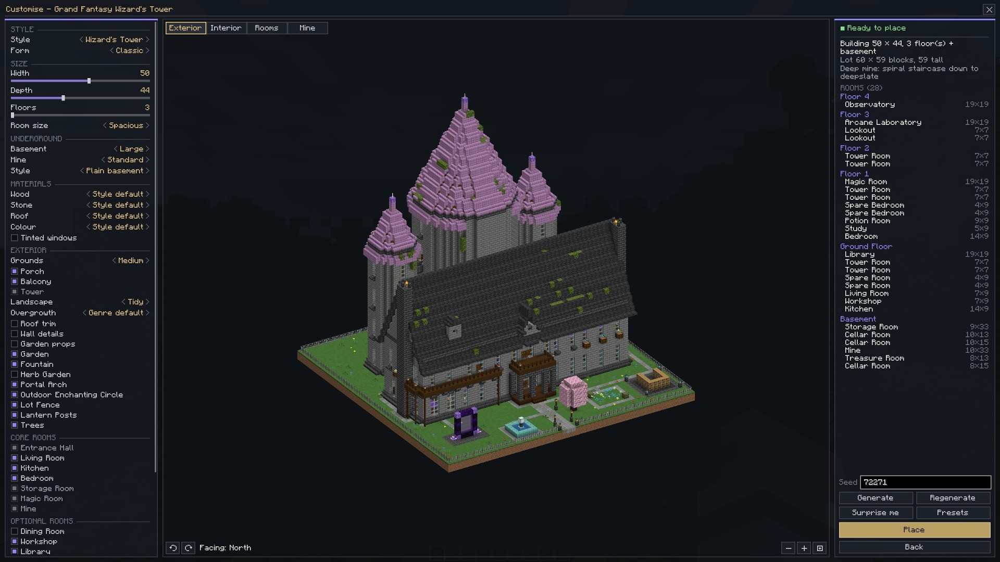

# RPG Prefab Houses

Minecraft **1.20.1** · Forge **47.1.0 or newer** · mod id `rpgprefabhouses`

**Download:** [CurseForge](https://www.curseforge.com/minecraft/mc-mods/rpg-prefab-houses) ·
[Modrinth](https://modrinth.com/mod/rpg-prefab-houses) · **Bugs and ideas:** [Issues](../../issues) ·
**Full guide:** [GUIDE.md](GUIDE.md) · **Changes:** [CHANGELOG.md](CHANGELOG.md)

Big houses you pick from a 3D catalogue, change to suit you and place in a few seconds. Vanilla blocks only. They
come furnished and lit, with plenty of empty floor left for your own chests, machines and magic.

RPG Prefab Houses is closed source. This repository is for bug reports, ideas, screenshots and changelogs.

More screenshots are in the [images](images) folder.

## Features

- **20 styles**, each with a cottage version: Stone & Timber Manor, Ranger Lodge, Adventurer's Keep, Village
  Homestead, Alchemist's Residence, Merchant Estate, Oasis Residence, Crooked Manor, Viking Longhouse, Wizard's Tower,
  Storybook Manor, Rustic Townhouse, Fairy Hut, Hillside Burrow, Gothic Manor, Dwarven Hall, Eastern House, Greek
  Villa, Treehouse and Alpine Chalet
- **Make it yours:** Small to Massive, 1–5 floors, rooms, basement, mine, materials and garden, with a live 3D preview
- **Underground:** themed basements and a deep mine down to deepslate, with what it dug out in chests at the bottom
- **Safe placement:** a ghost preview, lot blending, no lag spikes, and undo within 30 minutes
- **Builder's Hammer:** add wings and towers to a placed house
- **For servers:** prices and limits in the server config
- **Translations:** English, German, Spanish, Brazilian Portuguese, Russian and Chinese

## Getting started

1. Get the **Prefab House Catalogue** from the creative tab, with `/prefabhouse give`, or craft it (diamonds,
   gold blocks, obsidian, an eye of ender, a book and a map).
2. Right-click it, or press **K**, and pick a house. Press **Customise** (key **C**) to make it your own.
3. Press **Place**, aim the ghost, press **R** to rotate, then left-click to build.

The [guide](GUIDE.md) covers every option, command and server setting.

## AI Usage

I used AI tools while developing RPG Prefab Houses, for:

- all of the translations;
- some of the documentation and descriptions;
- UI design and development;
- limited help with code and debugging.

I designed the overall concept, the architecture, the procedural generation systems and the feature direction
myself, and I did the testing and balancing. AI was a development tool: I reviewed, changed and tested its
suggestions before anything went into the mod.

## License

RPG Prefab Houses is proprietary software and is not open source.

The mod and its source code may not be copied, modified, redistributed, or used in derivative projects without my
permission.

© 2026 loudev3010.
